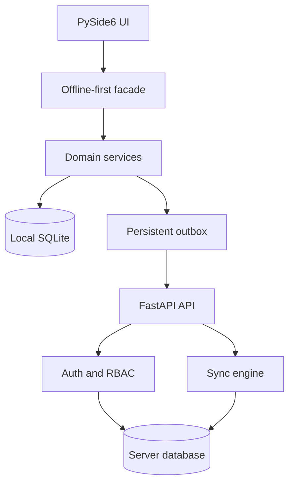

# Architecture

RiskApp is an offline-first desktop application backed by a FastAPI service. The design keeps domain behavior independent from Qt and isolates persistence and HTTP details behind adapters.

## Boundaries

| Area | Responsibility | Main location |
| --- | --- | --- |
| Desktop UI | Presentation and user interaction | `client/riskapp_client/ui_v2/` |
| Application services | Use cases, filtering, and sync orchestration | `client/riskapp_client/services/` |
| Client adapters | SQLite, outbox, mapping, and HTTP | `client/riskapp_client/adapters/` |
| API routers | Transport validation and authorization boundary | `server/riskapp_server/api/routers/` |
| Server core | Configuration, permissions, scoring, and queries | `server/riskapp_server/core/` |
| Persistence | SQLAlchemy models and session lifecycle | `server/riskapp_server/db/` |
| Synchronization | Pull cursors, version checks, receipt deduplication, audit | `server/riskapp_server/sync/` |

## Offline synchronization invariants

- Outbox replacement and change coalescing are atomic. Local entity mutation and outbox enqueue currently use separate transactions.
- At most one pending or blocked change exists per project/entity pair.
- Every change has a stable `change_id`; retained server receipts deduplicate push retries for that identifier.
- Existing-row sync updates and deletes require `base_version` and claim it with a conditional version increment. SQLite begins each push with `BEGIN IMMEDIATE`; databases with row-level locking rely on the conditional update. A stale concurrent writer therefore becomes an explicit conflict.
- Parent items are applied before child actions and assessments during pull.
- Every pull uses an application-time upper bound that remains fixed across all pagination pages. This closes the between-page watermark gap; a database-backed monotonic change sequence would additionally remove reliance on `updated_at` tracking commit order.
- Project-id promotion updates the complete local graph in one deferred-FK transaction and leaves foreign-key enforcement enabled.

## Security model

- Access tokens are short-lived JWTs with issuer, audience, expiry, and unique id.
- Refresh and password-reset tokens are random, stored only as keyed hashes, and rotated or consumed once.
- Project RBAC is enforced in both REST routers and  the sync engine.
- Production startup rejects default secrets, wildcard hosts, returned reset tokens, and wildcard credentialed CORS.
- Request bodies and response bodies are bounded; exported CSV neutralizes formula prefixes.
- The local SQLite cache relies on operating-system user isolation and restrictive file permissions. It is not encrypted at rest.

## Deliberate trade-offs

The in-process rate limiter is appropriate for a single demo process and has bounded memory. A multi-instance deployment should replace it with a shared store. SQLite
and automatic schema creation support local evaluation; production should use a managed database, explicit migrations, trusted-proxy configuration, centralized
logs, and external secret management.
