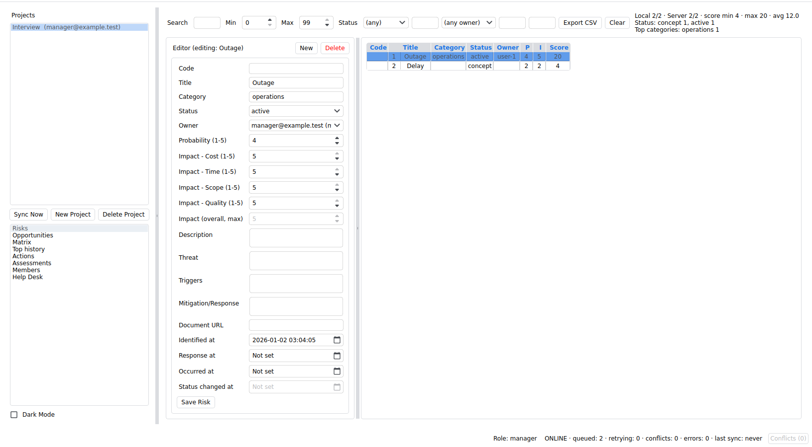
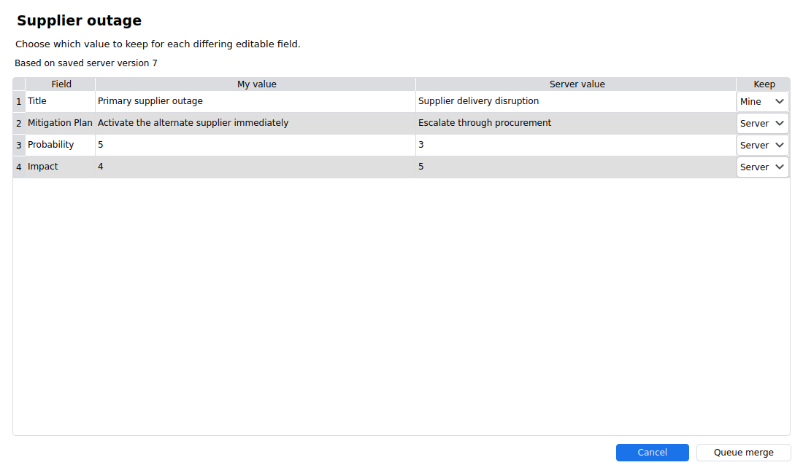

# Offline Risk & Opportunity Manager

[](https://github.com/Tomas-Skurla/risk-opportunity-manager/actions/workflows/ci.yml)
[](docs/README_QA.md)
[](docs/SETUP_GUIDE.md)
[](LICENSE)

RiskApp is an offline-first risk and opportunity manager: a FastAPI/SQLAlchemy API and a PySide6 desktop client with a local SQLite cache, persistent synchronization outbox, version-based conflict detection, project RBAC, audit receipts, and hashed rotating refresh tokens.

## What this repository demonstrates

- layered desktop architecture with domain services behind UI-independent adapters;
- offline operation with reliable automatic background synchronization, persistent queued writes, server receipt deduplication, and a transactional monotonic change sequence;
- a Qt Designer-backed Conflict Center that preserves unresolved writes and lets users explicitly keep the local copy, use the saved server copy, or decide later;
- authorization enforced consistently across REST and sync paths;
- Argon2id password hashing that upgrades stored hashes to new parameters at the next login;
- bounded request/response handling, literal search escaping, and safe CSV export;
- isolated API and client-core tests plus package-wide mypy, Ruff, compile, and dependency checks;
- reproducible runtime lock files and an automated CI gate.

## Quick start

See [ARCHITECTURE.md](docs/ARCHITECTURE.md) for boundaries, invariants, security choices, and explicit production trade-offs.

## Screenshots

### Risk workspace



### Field-level conflict merge



## Run the review checks

The suite runs Qt offscreen, so it does not need a display server but still requires the locked PySide6 runtime:

```bash
python3.14 -m venv .venv
source .venv/bin/activate
python -m pip install -r requirements-test.txt
bash scripts/check_project.sh
```

The check script validates a fresh Alembic migration, runs tests with a 90% combined coverage gate plus independent 92% line and 80% branch ratchets, package-wide mypy checks, Ruff, byte-compilation, and `pip check`. CI runs the same command on every push and pull request. Black remains available through `bash scripts/format.sh`; formatting-only normalization is intentionally separate.

CI pins third-party actions by full commit SHA, keeps security-event write access on the container job only, and uses Trivy to block actionable image vulnerabilities and exposed secrets. Trivy's image findings are also uploaded as SARIF when GitHub permits the event to write to code scanning

## Run the application

For the complete desktop environment, install the OS packages from
[step 2 of the setup guide](docs/SETUP_GUIDE.md#2-install-os-prerequisites), then run:

```bash
bash scripts/setup_python_env.sh
bash scripts/diagnose_qt_runtime.sh
bash scripts/check_project.sh
```

Start the API:

```bash
./scripts/dev-init.sh
bash scripts/run_server_dev.sh
```

Start the client in another terminal:

```bash
bash scripts/run_client_dev.sh
```

These startup commands preserve existing data. For a deliberate clean reset, prefix the corresponding command with `RESET_SERVER_DB=1` or `RESET_CLIENT_DB=1`. **Those reset flags delete the database, including any unsynced client changes.**

The setup script generates private keys and a random administrator password in
`.env`; rerunning it preserves existing values. The development launcher reads
that file and binds to localhost. Log in using `INITIAL_SUPERUSER_EMAIL` and
`INITIAL_SUPERUSER_PASSWORD` from `.env`. Interactive API documentation is at
`http://127.0.0.1:8000/docs`; health status is at `/health`.

## Run the development API with Docker

The container workflow packages only the FastAPI development server. The PySide6 desktop client continues to run natively so it can use the host desktop, local cache, and normal platform integration.

From the repository root, generate local credentials and start the API:

```bash
./scripts/dev-init.sh
docker compose up --build
```

Open `.env` locally to read `INITIAL_SUPERUSER_PASSWORD`. The initial login email
is `admin@example.com`, you can change it in `.env` before the first start.
Rerunning the script leaves any existing `.env` unchanged. To skip administrator
creation, clear both `INITIAL_SUPERUSER_EMAIL` and `INITIAL_SUPERUSER_PASSWORD`

Compose reads `.env` automatically. Variables exported in your shell take
precedence over the file, so remove stale exports when switching configurations.
Compose refuses to start with either key missing or empty. The API requires both
keys to contain at least 32 characters in every environment; there is no insecure
bypass. To validate the Compose configuration without printing secrets:

```bash
docker compose config --quiet
```

An existing private settings file can still be selected explicitly, for example:

```bash
docker compose --env-file .env.compose.local up --build
```

Verify it from another terminal:

```bash
curl http://127.0.0.1:8000/health
```

Then launch the native client with the existing script and log in with your own
account. Its development default already points to `http://127.0.0.1:8000`. To use
another host port, set both the Compose mapping and the client URL:

```bash
RISKAPP_HOST_PORT=8080 docker compose up --build
RISKAPP_URL=http://127.0.0.1:8080 bash scripts/run_client_dev.sh
```

Stop the server while retaining its data with:

```bash
docker compose down
```

Adding `--volumes` deletes the named SQLite volume and all its data.

For an existing database, changing the bootstrap variables does not change an
account's password or permissions. Change any previously used demo password
through the application. The bootstrap variables can be cleared after the
initial account is created. Replacing the signing and token-hash keys invalidates
existing tokens, users will need to log in again.

The separate test target installs the locked server and desktop dependencies, adds the Qt offscreen libraries, and runs the same migration, test, lint, compilation, and dependency checks as CI:

```bash
docker build --target test -t riskapp:test .
```

This is a local development/demo configuration. It deliberately preserves the repository's existing insecure demo secret and bootstrap credentials and is not a production deployment recipe.

## Repository map

```text
client/       PySide6 application, domain services, local store, HTTP adapter
server/       FastAPI routers, auth/RBAC, persistence, sync, operations
tests/        Canonical headless client-core and API regression suite
scripts/      Setup, quality, run, reset, and dependency-lock workflows
docs/         Setup, testing, architecture, and quality guides
```

Setup, testing, architecture, and development commands are linked from the [documentation index](docs/README.md).

## License

RiskApp is licensed under the [MIT License](LICENSE).

### Third-party software

RiskApp uses [PySide6 (Qt for Python)](https://doc.qt.io/qtforpython-6/),
which this project uses under the GNU Lesser General Public License v3.0.

PySide6 and Qt are separate third-party works and are not covered by
RiskApp's MIT License. This source repository does not bundle PySide6 or
Qt binaries; they are installed separately as dependencies.
