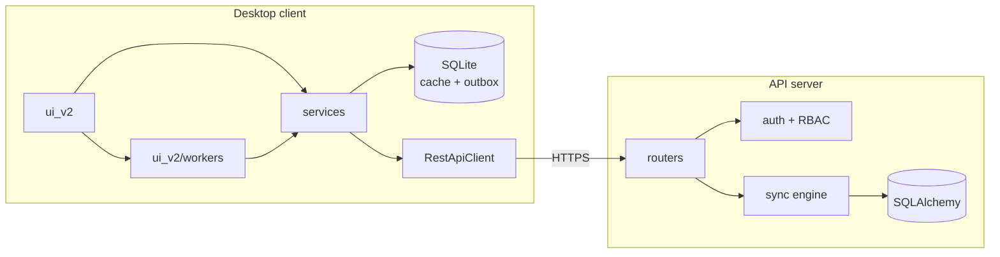
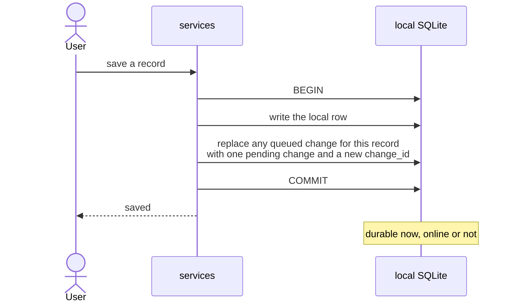
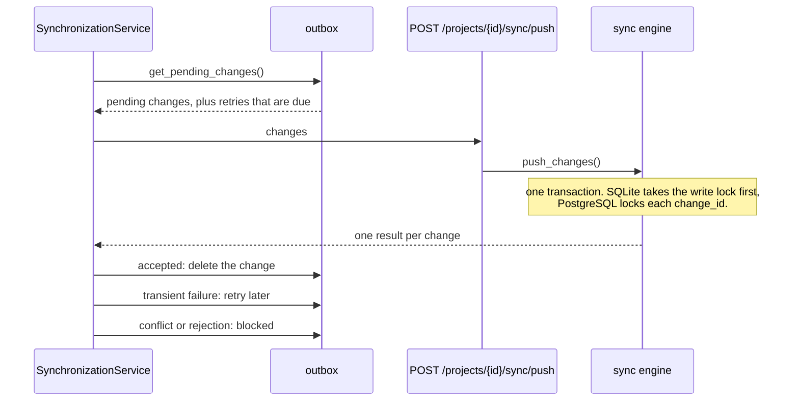
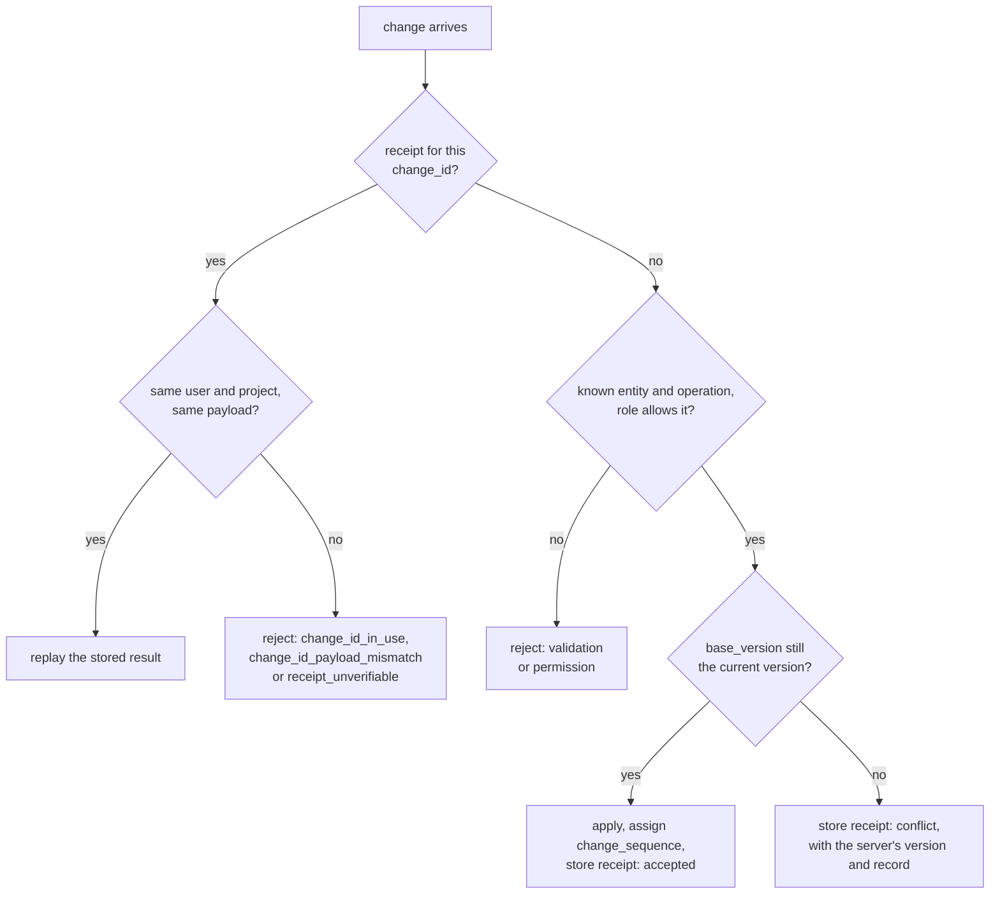
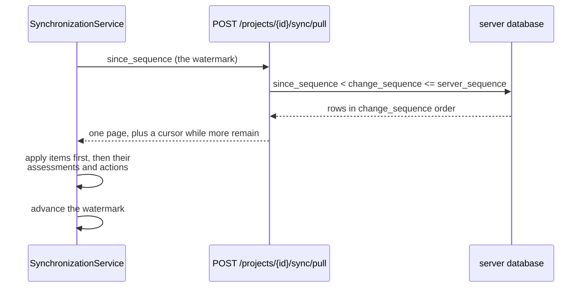
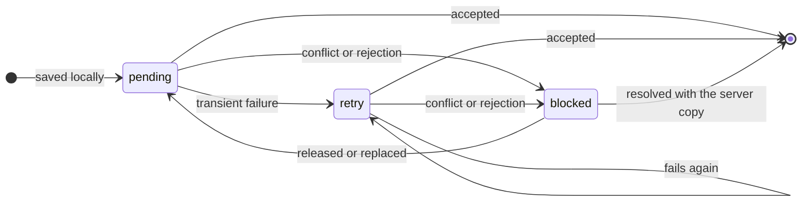
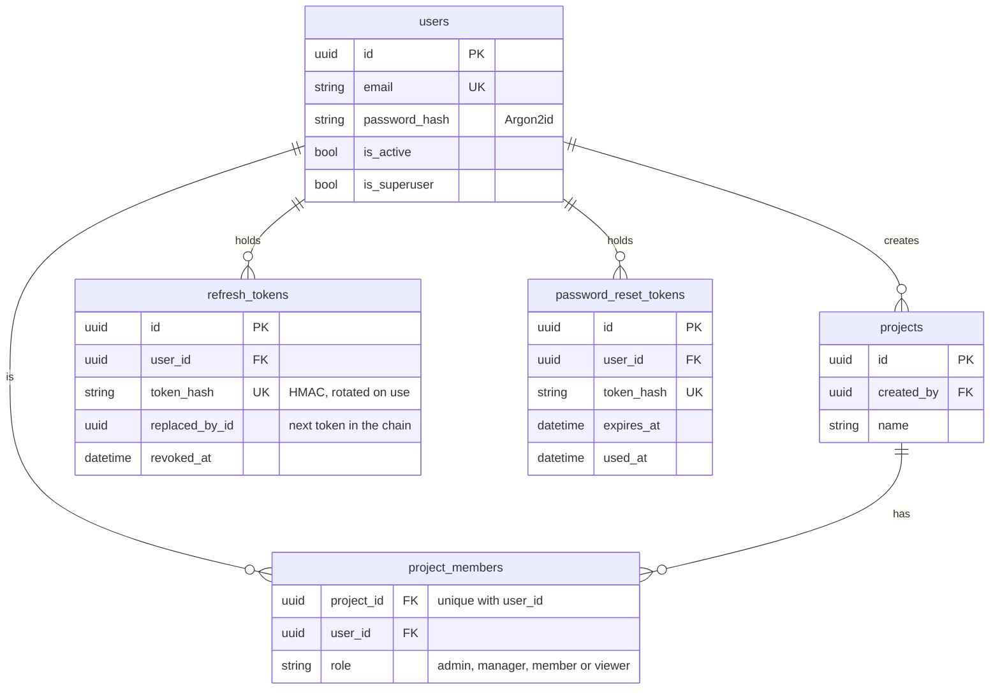
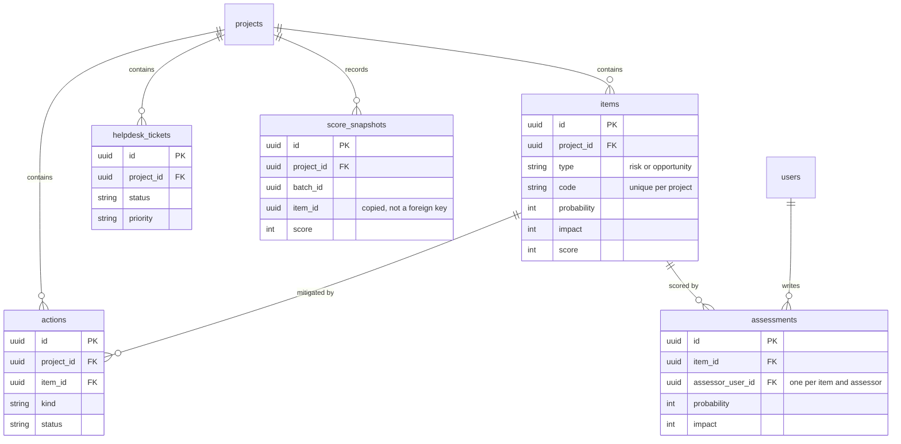
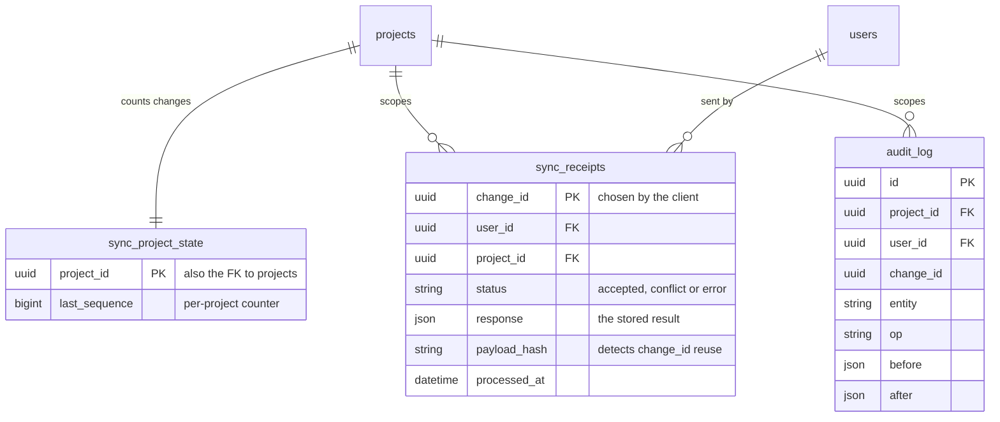

# Architecture

RiskApp is an offline-first desktop client backed by a FastAPI service. This document covers what is hard to read from the source: how the pieces fit
together, how a change travels from the desktop to the server, what happens when it cannot get there, and how the server stores it. It ends with the security model and the trade-offs made on purpose.

## 1. Components

The client's domain services never import Qt, which is what lets the test suite drive the client headless. Synchronization and history loading run on a background worker, so the window stays responsive during a sync. Project and member administration (creating or deleting a project, managing members) calls the server directly from the UI thread: these are short requests the user starts and waits for.

| Area | Responsibility | Location |
| --- | --- | --- |
| Desktop UI | Presentation and background jobs | `client/riskapp_client/ui_v2/` |
| Application services | Use cases, filtering, sync orchestration | `client/riskapp_client/services/` |
| Client adapters | SQLite cache, outbox, HTTP | `client/riskapp_client/adapters/` |
| API routers | Validation and the authorization boundary | `server/riskapp_server/api/routers/` |
| Server core | Configuration, permissions, scoring, queries | `server/riskapp_server/core/` |
| Persistence | SQLAlchemy models and sessions | `server/riskapp_server/db/` |
| Synchronization | Push, pull, receipts, audit | `server/riskapp_server/sync/` |

## 2. Synchronization

A sync runs per project and always pushes before it pulls. The client's own changes are then already part of the server state it is about to pull, so the pull cannot hand back a stale copy of a record the user just edited.

### 2.1 Saving a change

The local row and its outbox entry commit together or not at all. Each record has at most one queued change: a second edit replaces the first, keeps the version the first edit was based on, and gets a new `change_id`. The exception is a record whose change is blocked by a conflict. Editing it again only refreshes the local side of the conflict, which stays blocked until the user resolves it.

The `change_id` is created when the change is queued, not when it is sent. That is what makes sending it again safe.

### 2.2 Push

### 2.3 What the server decides for each change

A receipt is the server's memory of one `change_id`. A resent change gets the stored result back instead of being applied twice. `receipt_unverifiable` means the receipt has no stored payload hash to compare the resend against. An unexpected server error during a change is reported as transient and leaves no receipt, so the client can resend the same `change_id`.

### 2.4 Pull

The watermark is a per-project `change_sequence`, not a timestamp. Every syncable write takes the next number from a per-project counter in the same transaction, and one pull keeps `server_sequence` fixed across all its pages. Rows therefore cannot slip through at a page boundary or behind a clock that steps backwards. A timestamp-based pull remains only for older clients.

## 3. Lifecycle of a queued change

A change in the outbox is `pending`, `retry` or `blocked`. The distinction that matters is whether a person has to act: `retry` resolves itself on a timer, `blocked` does not.

### 3.1 Transient failures

No response at all, or HTTP 408, 425, 429 or 5xx, counts as transient. The change moves to `retry` and is sent again automatically after 2 s, 5 s, 15 s and 1 min, then every 5 min. A `Retry-After` from the server overrides that schedule, up to 24 hours. `retry_count` and `next_retry_at` live on the outbox row, so the schedule survives a restart.

### 3.2 Blocked changes

| Kind | Cause | What clears it |
| --- | --- | --- |
| `authentication` | HTTP 401 | The next successful login returns it to `pending` |
| `conflict` | The record changed on the server since this edit's base version | The Conflict Center, below |
| `permission` | HTTP 403 | Reported in the sync summary; the next edit of the record replaces it |
| `validation` | Any other rejection, such as a 4xx or a constraint violation | As for `permission` |
| `error` | A non-retryable failure that fits none of the above | As for `permission` |

### 3.3 Resolving a conflict

A blocked conflict keeps the server's version and record from its receipt, so the Conflict Center can show both sides without another request.

| Choice | What happens |
| --- | --- |
| Keep mine | The change is queued again with a new `change_id`, based on the server's version |
| Merge fields | The saved server copy is applied locally with the chosen local fields on top, and a new change is queued against the server's exact version. The pull watermark is rewound. |
| Use server | The blocked change is removed and the saved server copy applied locally. The pull watermark is rewound. |
| Later | Nothing changes |

Rewinding the watermark makes the next pull fetch the project again, so a server edit newer than the saved copy cannot be skipped. If the server changed again before a requeued change arrives, the version check produces another conflict, never a silent overwrite. Merging refuses to work from a stale server copy and asks for a sync first.

There is no three-way merge. The outbox stores no common ancestor, so a merge is a field-by-field choice between two known versions.

## 4. Server schema

The schema falls into three areas that meet only at `users` and `projects`. `items`, `assessments`, `actions` and `helpdesk_tickets` also carry the sync columns `version` (the optimistic lock), `change_sequence`, `is_deleted` (soft delete), `created_at` and `updated_at`, which are left out below.

### 4.1 Identity and access

### 4.2 Project data

`items` holds risks and opportunities in one table under `type`, so scoring, assessment and action logic is written once.

### 4.3 Sync machinery

`sync_receipts` is the idempotency store, not a log. Receipts do not expire on their own. Only the superuser prune endpoint
(`POST /admin/projects/{id}/maintenance/prune`) deletes them, never those younger than `SYNC_RECEIPT_RETENTION_DAYS` (365 days by default), and deleting a project removes its receipts with it. A resend is guaranteed to be idempotent only while its receipt exists, so that window should exceed the longest time a client may stay offline with unsent changes.

## 5. Invariants not shown above

- Updates and deletes of existing rows, through sync or through the REST API, carry `base_version` and claim it with a conditional version increment, so a stale concurrent writer becomes an explicit conflict.
- The per-project counter row serializes concurrent writers until commit, and a rollback also releases the number it reserved.
- Automatic synchronization is a GUI-thread timer around the single background worker. It does no I/O itself, syncs visible projects one at a time, honours saved retry times and its own reconnect backoff, and stops before application shutdown waits for the worker.
- Promoting a local-only project to a server id rewrites its whole local graph in one transaction, with foreign keys still enforced.

## 6. Security model

- Access tokens are short-lived JWTs with issuer, audience, expiry and a unique id.
- Passwords use Argon2id (`m=19456`, `t=2`, `p=1`). Hashes created with older parameters are upgraded after the next successful login.
- Refresh and password-reset tokens are random and stored only as HMAC hashes, keyed independently from JWT signing. Refresh rotation forms a single replacement chain. A just-rotated token gets one short recovery window while its replacement is unused; any other reuse revokes that token family.
- Project roles are enforced in both the REST routers and the sync engine. Superusers act as admins of every project.
- Superuser-only operations live under `/admin/`, where the router itself requires a superuser, so a gateway can separate them with one path rule.
- Every environment requires explicit signing and token-hash keys of at least 32 characters. Production startup also rejects wildcard hosts and returned reset tokens. Wildcard credentialed CORS is rejected everywhere.
- Request and response bodies are size-limited, and exported CSV neutralizes formula prefixes.
- API responses and logs share a validated correlation id. Structured JSON logging never records request bodies, query strings or tokens.
- The local SQLite cache relies on operating-system user isolation and restrictive file permissions. It is not encrypted at rest.

## 7. Deliberate trade-offs

The in-process rate limiter suits a single process and has bounded memory, so a multi-instance deployment should replace it with a shared store. SQLite and automatic schema creation support local evaluation. Production should use a managed database, explicit migrations, trusted-proxy configuration, centralized logs and external secret management.

`SECRET_KEY` signs access tokens and `TOKEN_HASH_KEY` hashes refresh and password-reset tokens. Generate them independently: there is no fallback from one to the other. Changing `SECRET_KEY` invalidates access tokens; changing `TOKEN_HASH_KEY` invalidates refresh tokens and reset links. Neither affects accounts or data.

Argon2id uses OWASP's minimum profile (19 MiB, two iterations) to keep login fast on small deployments. The parameters are stored in each hash, and a successful login upgrades hashes made with older parameters, so raising them later needs no forced password reset.
